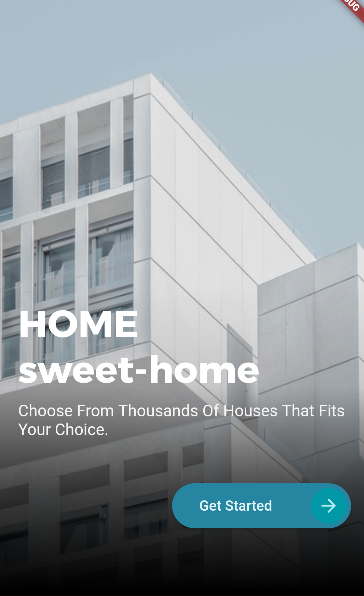
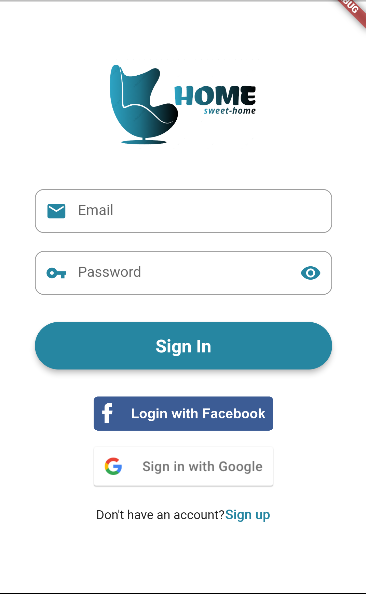
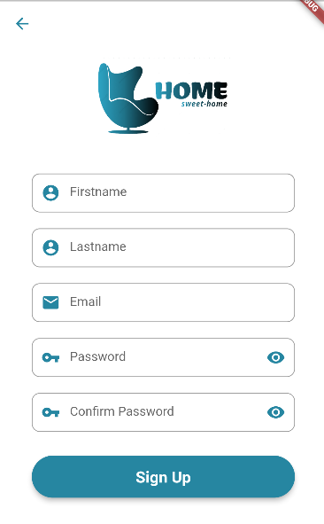
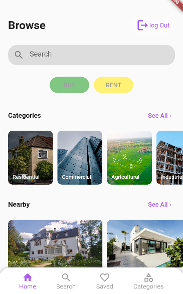
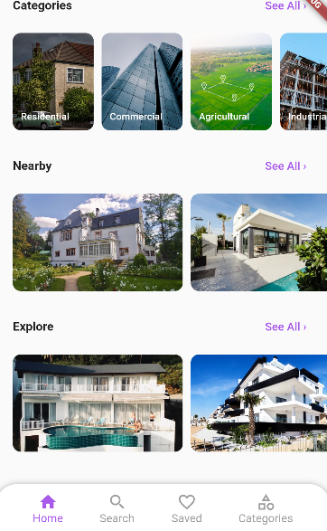
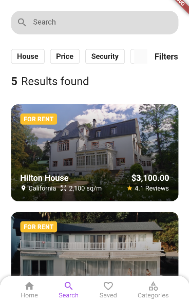
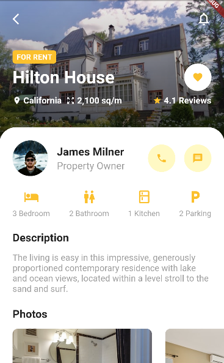
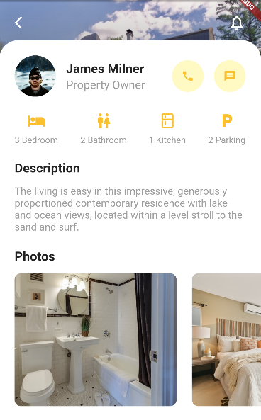
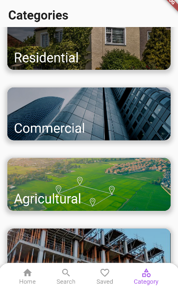
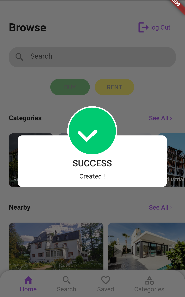

# Real Estate App

HOME SWEET-HOME is a real estate app that represents an online sellers or buyers of real estate or real property, Created with Flutter/Firebase.

## ✨ Requirements
* Any Emulator (preference Android Emulator)
* Any IDE with Flutter SDK installed (ie. IntelliJ, Android Studio, VSCode etc)
* A little knowledge of Dart and Flutter
* A brain to think 🤓🤓

## 📸 ScreenShots
| Start page |
|------|
||

| Sign in | Sign up|
|------|-------|
|||

| Home page | Home page|
|------|-------|
|||

| Search page | Detail page|
|------|-------|
|||

| Detail page | Categories page|
|------|-------|
|||

| Validation pop-up |
|------|
||

## Getting Started

This project is a starting point for a Flutter application.

A few resources to get you started if this is your first Flutter project:

- [Lab: Write your first Flutter app](https://flutter.dev/docs/get-started/codelab)
- [Cookbook: Useful Flutter samples](https://flutter.dev/docs/cookbook)

For help getting started with Flutter, view our
[online documentation](https://flutter.dev/docs), which offers tutorials,
samples, guidance on mobile development, and a full API reference.
